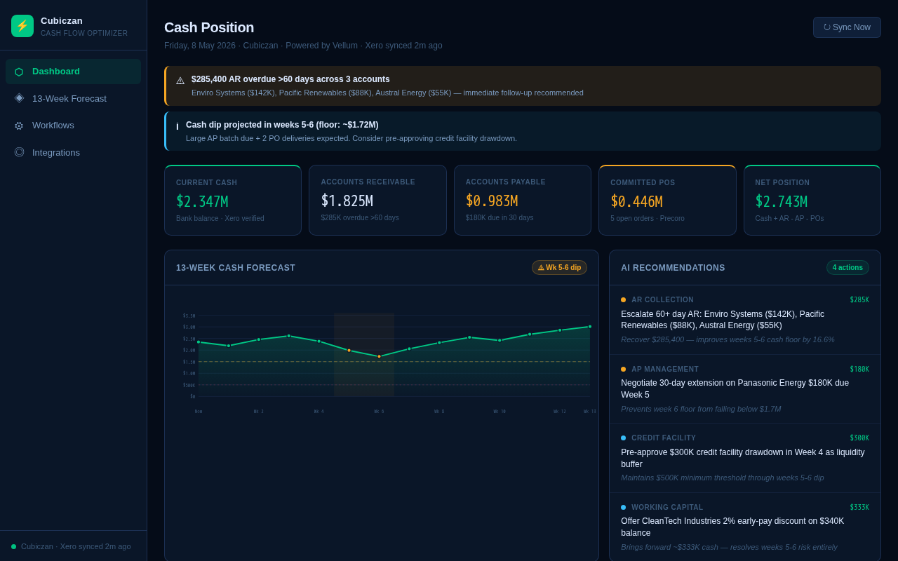
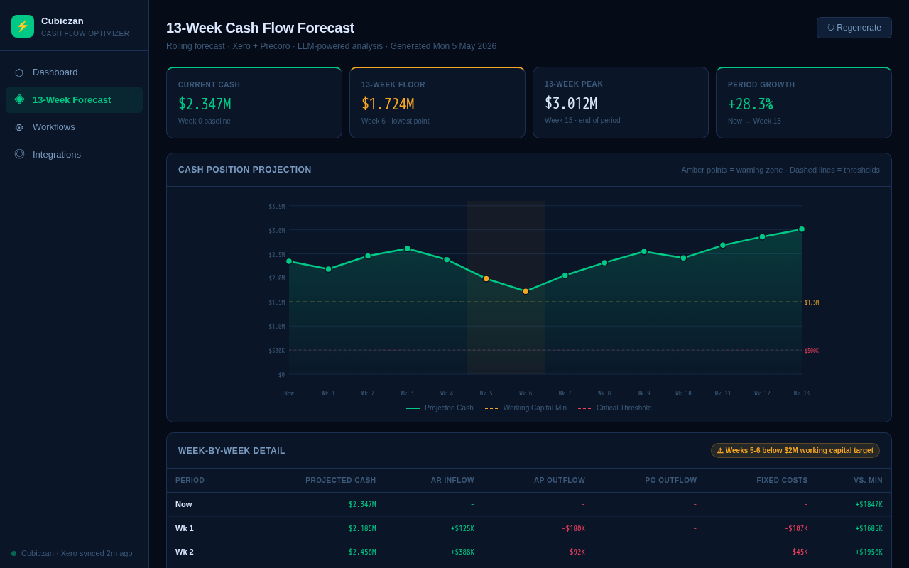
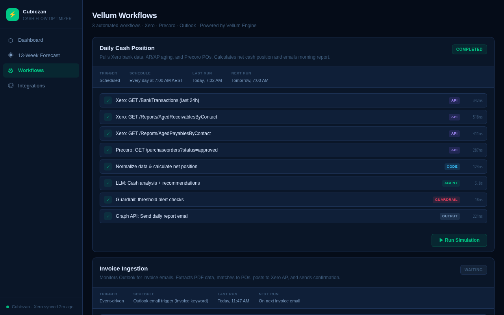
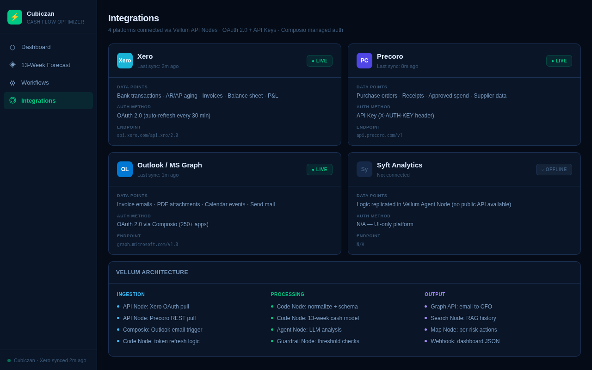

# Cash Flow Optimizer — Cubiczan

A Vellum-powered cash flow intelligence system with real-time Xero, Precoro, and Outlook integration.

## Screenshots

| Dashboard | 13-Week Forecast |
|---|---|
|  |  |

| Workflows | Integrations |
|---|---|
|  |  |

## What It Does

- **Daily Cash Position** — automated 7am report: Xero bank balance + AR/AP aging + Precoro committed POs → LLM analysis → email to CFO
- **Invoice Ingestion** — Outlook trigger → PDF extraction → 3-way PO match → auto-post to Xero AP
- **13-Week Rolling Forecast** — Monday 6am: Xero balance sheet + AR/AP schedule + POs → LLM narrative + risk register → email to CFO + Moelis team

## Architecture

```
Triggers (Cron / Outlook) → API Nodes (Xero, Precoro, Graph API)
  → Code Nodes (normalize, forecast, anomaly detect)
  → Agent Node (LLM cash analysis)
  → Guardrail Node (threshold alerts)
  → Output (email, dashboard webhook)
```

## Vellum Nodes Used

| Node Type | Purpose |
|---|---|
| API Node | Xero OAuth calls, Precoro REST, MS Graph |
| Code Node | Token refresh, normalization, forecast model |
| Agent Node | LLM cash analysis + recommendations |
| Guardrail Node | Critical/warning threshold checks |
| Composio | Outlook OAuth (250+ app managed auth) |
| Search Node | RAG query on historical cash patterns |
| Map Node | Per-risk action item generation |

## Platform Integrations

| Platform | Auth | What's Pulled |
|---|---|---|
| **Xero** | OAuth 2.0 (30-min auto-refresh) | Bank txns, AR/AP aging, invoices, balance sheet |
| **Precoro** | API Key (`X-AUTH-KEY` header) | Purchase orders, receipts, approved spend |
| **Outlook** | OAuth 2.0 via Composio | Invoice emails, PDF attachments, calendar |
| **Syft** | N/A — no public API | Logic replicated via Vellum Agent + Code Nodes |

## Code Nodes (`code-nodes/`)

| File | Workflow | Purpose |
|---|---|---|
| `xero_token_refresh.py` | All | OAuth token exchange before every Xero call |
| `data_normalizer.py` | WF1 | Normalize Xero + Precoro → unified schema |
| `forecast_model.py` | WF3 | Build 13-week rolling cash model |
| `anomaly_detector.py` | WF1 | Z-score anomaly detection (replaces Syft) |
| `invoice_parser.py` | WF2 | PDF extraction + 3-way match + Xero payload |

## Dashboard App (`/workspace/data/apps/cash-flow-optimizer/`)

Interactive Preact + Chart.js dashboard with 4 tabs:
- **Dashboard** — KPIs, 13-week mini chart, AR/AP aging, AI recommendations, committed POs
- **13-Week Forecast** — full chart + week-by-week detail table
- **Workflows** — animated simulation of all 3 Vellum workflows
- **Integrations** — live status of Xero, Precoro, Outlook, Syft

## Implementation Roadmap

| Phase | Week | Deliverable |
|---|---|---|
| 1. Foundation | 1-2 | Xero connection, daily cash pull, basic email |
| 2. Procurement | 3 | Precoro POs, committed spend tracking |
| 3. Intelligence | 4-5 | LLM forecast, anomaly detection (replaces Syft) |
| 4. Email Automation | 6 | Outlook ingestion, PDF extraction, AR follow-ups |
| 5. Refinement | 7-8 | RAG history, evaluation suite, dashboard API |

## Key Technical Decisions

1. **Xero token expiry** — Code Node refreshes OAuth token before every call, stores new refresh token in external KV (Redis/DynamoDB/Supabase)
2. **Syft replacement** — Agent Node + Code Node replicate cash forecasting, variance analysis, and ratio analysis from raw Xero data
3. **State across runs** — Daily snapshots stored in Vellum Document Index (or external DB) for RAG-based trend analysis
4. **Rate limits** — Xero: 60/min, batch requests and cache. Precoro: 60/min, pull once daily + webhooks

## Environment Variables

```env
# === Xero ===
XERO_CLIENT_ID=
XERO_CLIENT_SECRET=
XERO_REFRESH_TOKEN=
XERO_TENANT_ID=

# === Precoro ===
PRECORO_API_KEY=

# === Microsoft Graph / Outlook ===
MS_GRAPH_CLIENT_ID=
MS_GRAPH_CLIENT_SECRET=
MS_GRAPH_TENANT_ID=

# === Composio (Outlook OAuth via managed auth) ===
COMPOSIO_API_KEY=

# === Vellum ===
VELLUM_API_KEY=

# === KV Store (token persistence) ===
KV_STORE_URL=
KV_STORE_TOKEN=
```

## License

MIT
